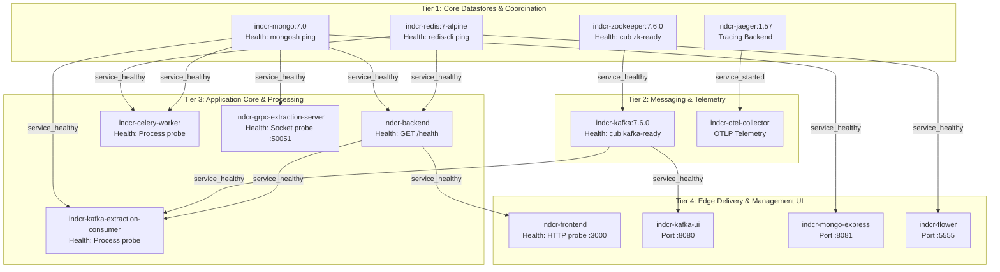

# Docker Compose Health-Check Chain & Container Security Architecture

This document specifies the health-check dependency graph, non-root execution policies, and container build hygiene for the **Intelligent Document Confidence Reviewer (INDCR)** application.

---

## 1. Health-Check Dependency Chain (4-Tier Architecture)

To ensure deterministic, error-free system startup without race conditions, containers start and wait for their upstream dependencies to reach the `healthy` status before initializing.



---

## 2. Health-Check Specification by Service

| Service | Health-Check Command | Interval | Timeout | Retries | Start Period | Dependent Services (condition) |
|:---|:---|:---:|:---:|:---:|:---:|:---|
| **`mongo`** | `mongosh --quiet --eval "db.adminCommand('ping')"` | 10s | 5s | 10 | 10s | `backend`, `celery_worker`, `kafka_extraction_consumer`, `grpc_extraction_server`, `mongo-express` (`service_healthy`) |
| **`redis`** | `redis-cli ping` | 10s | 3s | 10 | 5s | `backend`, `celery_worker`, `flower` (`service_healthy`) |
| **`zookeeper`** | `cub zk-ready 127.0.0.1:2181 2` | 10s | 5s | 10 | 10s | `kafka` (`service_healthy`) |
| **`kafka`** | `cub kafka-ready 1 2 -b localhost:9092` | 10s | 10s | 10 | 25s | `kafka_extraction_consumer`, `kafka-ui` (`service_healthy`) |
| **`backend`** | `python -c "import urllib.request as r; ... HTTP 200"` | 10s | 5s | 5 | 15s | `frontend`, `kafka_extraction_consumer` (`service_healthy`) |
| **`celery_worker`** | `python -c "import os; os.kill(1, 0)"` | 20s | 5s | 3 | 15s | Standalone background processor |
| **`kafka_extraction_consumer`**| `python -c "import os; os.kill(1, 0)"` | 20s | 5s | 3 | 15s | Standalone background processor |
| **`grpc_extraction_server`** | `python -c "import socket; s.connect(('127.0.0.1', 50051))"` | 15s | 5s | 5 | 10s | Standalone gRPC service |
| **`frontend`** | `node -e "require('http').get('http://127.0.0.1:3000', ...)"` | 15s | 5s | 5 | 20s | Edge web client |

---

## 3. Non-Root Container Execution Matrix

In accordance with least-privilege security standards, all application containers execute as dedicated, unprivileged system users:

| Service / Image | User Name | UID | GID | Multi-Stage Build | Privileges Dropped |
|:---|:---|:---:|:---:|:---:|:---|
| **`indcr-backend`** | `appuser` | `10001` | `10001` | Yes (`builder` & `runtime`) | Dropped to `appuser` before entrypoint |
| **`indcr-celery-worker`** | `appuser` | `10001` | `10001` | Yes (`builder` & `runtime`) | Dropped to `appuser` before entrypoint |
| **`indcr-kafka-extraction-consumer`** | `appuser` | `10001` | `10001` | Yes (`builder` & `runtime`) | Dropped to `appuser` before entrypoint |
| **`indcr-grpc-extraction-server`** | `appuser` | `10001` | `10001` | Yes (`builder` & `runtime`) | Dropped to `appuser` before entrypoint |
| **`indcr-frontend`** | `nextjs` | `1001` | `1001` (`nodejs`) | Yes (`deps`, `builder`, `runner`) | Dropped to `nextjs` before entrypoint; all runtime files chowned |
| **`indcr-mongo`** | `mongodb` | `999` | `999` | Upstream official image | Default unprivileged daemon user |
| **`indcr-redis`** | `redis` | `999` | `999` | Upstream official image | Default unprivileged daemon user |

---

## 4. `.dockerignore` Hygiene & Secret Exclusion

All build contexts maintain strict `.dockerignore` filters to guarantee minimal image sizes, rapid layer caching, and zero secret leakage:

- **Root `.dockerignore`**: Excludes `.git`, `.github`, `.venv*`, `node_modules`, build outputs (`.next`, `out`, `dist`), log files, and environment files (`.env*`).
- **`backend/.dockerignore`**: Excludes local virtual environments (`.venv/`, `env/`), bytecode (`__pycache__/`, `*.pyc`), test suites (`tests/`), test caches (`.pytest_cache/`, `.coverage`), and credential files (`.env*`).
- **`frontend/.dockerignore`**: Excludes host `node_modules/`, compiler caches (`.next/`, `*.tsbuildinfo`, `.turbo/`), unit tests, test coverage, and local environment files (`.env*.local`, `.env*`).

---

## 5. Verification Commands

Verify all running containers are non-root:
```bash
# Check custom backend images (returns 10001)
docker compose exec backend id -u
docker compose exec celery_worker id -u
docker compose exec kafka_extraction_consumer id -u
docker compose exec grpc_extraction_server id -u

# Check custom frontend image (returns 1001)
docker compose exec frontend id -u
```

Verify health check statuses:
```bash
docker compose ps
```
